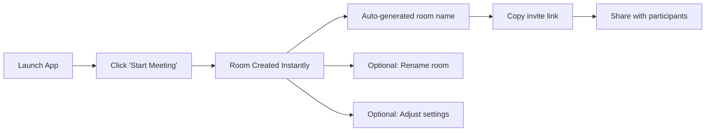
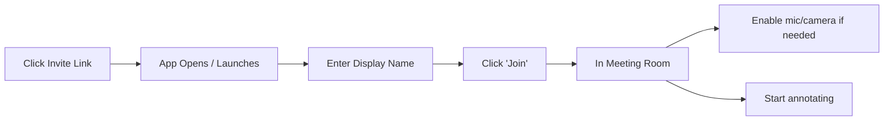
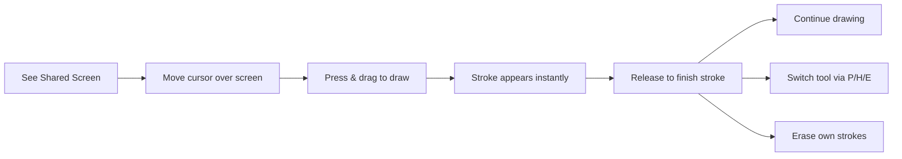

# Etch UX Design Specification

_Created on 2025-11-29 by BMad_
_Generated using BMad Method - Create UX Design Workflow v1.0_

---

## Executive Summary

**Etch** is an open-source, self-hosted meeting platform with real-time screen annotations. It fills the gap between proprietary tools (Zoom, Teams) and open alternatives (Jitsi) by enabling participants to draw directly on shared screens with < 200ms latency.

**Target Users:** Developer teams (code reviews, debugging), Design teams (prototype feedback), and IT/Support technicians (remote troubleshooting)

**Platform:** Desktop application (macOS, Windows) for v1

**Core Value:** The "pointing finger" moment - draw on someone's screen and everyone sees it instantly. No more "the button on the left... no, your other left."

**Desired Feeling:** Connected and engaged - present with collaborators despite physical distance.

**Design Philosophy:** Around's minimal floating presence + Zoom's familiar annotation tools + Slack's "obvious over clever" approach. Content-first, non-intrusive UI that slips into the background.

**UX Complexity:** Moderate - real-time collaboration with 4 user roles (host, sharer, annotator, viewer), but single platform and focused feature set.

---

## 1. Design System Foundation

### 1.1 Design System Choice

**Selected:** shadcn/ui + Tailwind CSS

**Rationale:**
- Matches "developer tool aesthetic" - clean, functional, no unnecessary flourish
- Dark mode built-in (default for developer environments)
- Built on Radix UI primitives - accessibility-first, WCAG compliant
- Highly customizable without fighting the framework
- Cross-platform neutral - looks appropriate on both macOS and Windows
- Aligns with "obvious over clever" philosophy from Slack inspiration
- [Tauri UI template](https://github.com/agmmnn/tauri-ui) provides native window controls

**What shadcn/ui Provides:**
- Buttons, forms, dialogs, dropdowns, tooltips
- Dark/light theme system with CSS variables
- Accessible keyboard navigation
- Consistent spacing and typography scale

**Custom Components Needed:**
- Annotation toolbar (pen, highlighter, eraser, clear)
- Annotation canvas overlay
- Participant video bubbles (Around-style floating heads)
- Screen share viewer with annotation layer
- Sharer floating control bar (always-on-top controls when sharing)
- Share border indicator (visual frame around shared content)
- Permission/role indicators
- Connection status indicators

**Technical Stack:**
- Tailwind CSS for utility-first styling
- Radix UI for accessible primitives
- CSS variables for theming
- Lucide icons (included with shadcn/ui)

---

## 2. Core User Experience

### 2.1 Defining Experience

**Core Actions (Priority Order):**

1. **Screen Sharing with Annotations** - The primary differentiator. Users share their screen and others can draw on it in real-time. This must feel like drawing on glass - immediate, precise, and natural.

2. **Creating/Joining Meetings** - Must be frictionless. One click to create, one link to join. No accounts required for participants.

3. **Video/Audio Streams** - Standard meeting functionality. Camera and microphone feeds for face-to-face communication context.

**Platform:** Desktop only (macOS, Windows) for v1. No web or mobile clients in initial release.

**What Must Be Effortless:**
- Starting to annotate (no mode switching, no tool hunting)
- Joining a meeting (click link → enter name → you're in)
- Sharing your screen (one click, pick window, done)

**Desired Emotional Response: Connected and Engaged**

Users should feel like they're truly collaborating in the same room, not just watching a remote screen. The annotation layer bridges the physical gap - when you draw on someone's screen and they react instantly, you feel *present* with them.

**Design Implications:**
- Real-time feedback is essential (annotations appear instantly, not after a delay)
- Visual presence cues (who's annotating, cursor indicators)
- Low friction to participate (the easier it is to draw, the more engaged people feel)
- Ephemeral by default (annotations are conversational, not permanent artifacts)

### 2.3 Inspiration Analysis

**Around.co** (acquired by Miro)
- Floating head bubbles - minimal visual footprint, faces only
- Non-intrusive design that "slips into the background"
- Video presence without dominating screen real estate
- *Takeaway:* Keep participant video visible but unobtrusive during screen share

**Zoom Annotations**
- Toolbar-based access to drawing tools
- Standard toolkit: pen, highlighter, shapes, arrows, text, eraser
- Customizable colors and line thickness
- *Takeaway:* Familiar annotation patterns users already understand

**Slack**
- "Obvious over clever" design philosophy
- Minimal choices, stripped-back interface
- Purple gradient aesthetic with depth
- *Takeaway:* Don't reinvent the wheel; use familiar patterns

**Synthesized UX Principles for Etch:**

| Principle | Inspiration | Application |
|-----------|-------------|-------------|
| Minimal presence | Around | Floating participant bubbles during annotation |
| Familiar tools | Zoom | Standard annotation toolbar pattern |
| Obvious over clever | Slack | Use patterns users already know |
| Content-first | Around | Strip unnecessary pixels, focus on shared screen |
| Non-intrusive | Around | UI slips into background, content dominates |

### 2.2 Novel UX Patterns

**Defining Experience:** "Draw on someone's shared screen and everyone sees it instantly"

**Pattern Classification:** Refined Standard Pattern

The annotation-on-screen-share pattern exists (Zoom, Teams), but Etch refines it with:

| Aspect | Standard (Zoom) | Etch Refinement |
|--------|-----------------|---------------------|
| Latency | Noticeable delay | < 200ms (imperceptible) |
| Rendering | Server-composited | Local compositing |
| Feel | Drawing "in" the app | Drawing "on glass" over content |
| Presence | Full video rectangles | Minimal floating bubbles |
| Permanence | Persistent until cleared | Ephemeral, conversational |

**Core Interaction: "Drawing on Glass"**

The annotation experience should feel like placing a transparent sheet of glass over someone's screen and drawing on it with a marker. Key characteristics:

1. **Zero mode switch** - Cursor is always ready to draw on annotation-enabled areas
2. **Instant ink** - Stroke appears under cursor immediately (local render), then syncs
3. **Transparency** - Annotations overlay content without obscuring it
4. **Natural tool access** - Number keys (1-8, 0) like Excalidraw, or click toolbar icons
5. **Ephemeral default** - Strokes feel temporary, easy to clear, not precious artifacts

**Sharer Experience: "Stay in Your Flow"**

When you're sharing your screen, Etch gets out of your way:

1. **App minimizes** - Main Etch window disappears, your shared content is front and center
2. **Floating control bar** - Small, draggable bar stays on top with essential controls
3. **Visual share border** - Clear indication of what's being captured
4. **Annotation overlay** - See everyone's drawings on your actual screen, not in a separate window
5. **One-click stop** - End sharing instantly from the floating bar

This means the sharer can continue working in VS Code, Figma, or any app while staying connected to the meeting and seeing annotations in real-time.

**Why This Matters:**
The moment someone draws a circle around a button and says "this one" - and everyone sees it instantly - that's the magic moment. The UX must make that moment effortless and immediate.

### 2.4 Core Experience Principles

These principles guide every UX decision in Etch:

| Principle | Definition | Application |
|-----------|------------|-------------|
| **Speed** | Instant response, zero perceptible delay | Local stroke rendering < 16ms, network sync < 200ms, no loading spinners for core actions |
| **Guidance** | Minimal - users are professionals | No onboarding wizards, tooltips on hover only, keyboard shortcuts for power users |
| **Flexibility** | Simple defaults, power when needed | Pen tool active by default, shortcuts for tool switching, host controls for moderation |
| **Feedback** | Subtle and informative | Cursor changes on tool selection, connection status indicator, participant colors for attribution |

**Speed Principle (Priority #1)**
- Actions must feel instant - "I click, it happens"
- Local-first rendering: show the result immediately, sync in background
- No blocking operations during annotation
- Connection issues shown but don't interrupt drawing

**Guidance Principle**
- Target users are developers, designers, IT pros - they learn fast
- Discoverable through doing, not tutorials
- Keyboard shortcuts visible on hover (e.g., button shows "P" for pen)
- Error messages are helpful and actionable

**Flexibility Principle**
- Sensible defaults that work for 90% of cases
- Power features accessible but not in the way
- Role-based capabilities are clear but not limiting
- Settings are minimal - fewer choices = faster to start

**Feedback Principle**
- Every action has immediate visual confirmation
- Connection state always visible (but subtle when healthy)
- Who's annotating is clear (color-coded strokes)
- Errors are noticeable but not alarming

---

## 3. Visual Foundation

### 3.1 Color System

**Theme Strategy:** Dark mode default with light mode option

Inspired by Linear, Actual, and shadcn/ui — minimal, monochromatic, purposeful color usage.

#### Dark Theme (Default)

| Token | Value | Usage |
|-------|-------|-------|
| `--background` | #09090b | App background |
| `--background-subtle` | #0a0a0c | Sidebar, elevated areas |
| `--card` | #0c0c0e | Cards, panels |
| `--card-hover` | #111113 | Hover states |
| `--border` | rgba(255,255,255,0.06) | Borders, dividers |
| `--text-primary` | #fafafa | Headings, primary text |
| `--text-secondary` | #a1a1aa | Body text |
| `--text-muted` | #71717a | Labels, captions |
| `--text-faint` | #52525b | Placeholders, disabled |
| `--accent` | #8b5cf6 | Primary actions (violet) |
| `--accent-hover` | #7c3aed | Accent hover state |

#### Light Theme (User Preference)

| Token | Value | Usage |
|-------|-------|-------|
| `--background` | #f7fafc | App background |
| `--background-subtle` | #edf2f7 | Sidebar, elevated areas |
| `--card` | #ffffff | Cards, panels |
| `--border` | rgba(0,0,0,0.08) | Borders, dividers |
| `--text-primary` | #0f172a | Headings, primary text |
| `--text-secondary` | #475569 | Body text |
| `--accent` | #0066ff | Primary actions (blue) |

#### Semantic Colors (Both Themes)

| Token | Value | Usage |
|-------|-------|-------|
| `--success` | #22c55e | Connected, success states |
| `--warning` | #f59e0b | Reconnecting, warnings |
| `--error` | #ef4444 | Disconnected, errors |
| `--info` | #3b82f6 | Informational |

#### Annotation Colors (Per Participant)

High-visibility colors that work on any screen content:

| Participant | Dark Theme | Light Theme |
|-------------|------------|-------------|
| You (P1) | #f97316 Orange | #ea580c Orange |
| P2 | #06b6d4 Cyan | #0891b2 Cyan |
| P3 | #a855f7 Purple | #9333ea Purple |
| P4 | #22c55e Green | #16a34a Green |
| P5 | #ec4899 Pink | #db2777 Pink |

### 3.2 Typography

**Font Family:** Inter (with system fallbacks)
- Primary: `'Inter', -apple-system, BlinkMacSystemFont, 'Segoe UI', sans-serif`
- Monospace: `'SF Mono', Monaco, 'Fira Code', monospace`

**Type Scale:**

| Element | Size | Weight | Line Height |
|---------|------|--------|-------------|
| H1 | 2rem (32px) | 600 | 1.2 |
| H2 | 1.5rem (24px) | 600 | 1.3 |
| H3 | 1.25rem (20px) | 600 | 1.4 |
| Body | 0.875rem (14px) | 400 | 1.5 |
| Small | 0.75rem (12px) | 500 | 1.4 |
| Caption | 0.7rem (11px) | 500 | 1.3 |

### 3.3 Spacing & Layout

**Base Unit:** 4px

**Spacing Scale:**
- xs: 4px
- sm: 8px
- md: 16px
- lg: 24px
- xl: 32px
- 2xl: 48px
- 3xl: 64px

**Border Radius:**
- sm: 4px (badges, small elements)
- md: 8px (buttons, inputs, cards)
- lg: 12px (panels, modals)
- full: 9999px (pills, avatars)

**Interactive Visualizations:**

- Color Theme Explorer (Dark): [ux-color-themes.html](./ux-color-themes.html)
- Color Theme Explorer (Light): [ux-color-themes-light.html](./ux-color-themes-light.html)

---

## 4. Design Direction

### 4.1 Chosen Design Approach

**Strategy:** Hybrid layout with mode switching

Combines the best elements from multiple directions to serve both "everything visible" and "get out of the way" use cases.

#### Default Mode (Sidebar + Tabs)

Based on Direction #1 (Classic Sidebar) + #3 (Split View):

```
┌─────────────────────────────────────────────────────────────┐
│  ○ ○ ○         Etch — Room Name                         │
├──────────────┬──────────────────────────────────┬───────────┤
│  Room Info   │  [P] [H] [E] | [C]    Connected  │ People    │
│  ─────────── ├──────────────────────────────────┤ Chat      │
│  PARTICIPANTS│                                   │ Activity  │
│  ○ You (Host)│                                   ├───────────┤
│  ○ Alice     │      Shared Screen Content        │           │
│  ○ Bob       │         + Annotations             │ Participant│
│              │                                   │ Grid/List │
│              │                                   │           │
│  ─────────── │                                   │           │
│  [Invite]    │                                   │           │
└──────────────┴──────────────────────────────────┴───────────┘
```

**Layout characteristics:**
- Left sidebar: Collapsible (toggle with `⌘\` or button)
- Right panel: Tabbed (People/Chat/Activity) - extensible for future features
- Toolbar: Persistent annotation tools + connection status
- Canvas: Main shared screen area with annotation overlay

#### Focus Mode (Viewer)

Based on Direction #6 - toggle with `F` key or double-click canvas. This is what **viewers** see when watching a shared screen:

```
┌─────────────────────────────────────────────────────────────┐
│  ○ ○ ○                                        ESC for menu  │
├─────────────────────────────────────────────────────────────┤
│                    [P][H][E][C]  (fades)                    │
│                                                             │
│                                                             │
│              Shared Screen Content (95% width)              │
│                    + Annotations                            │
│                                                             │
│                                                             │
│  ● Connected                              [Y] [A] [B]       │
└─────────────────────────────────────────────────────────────┘
```

**Focus mode characteristics:**
- All UI fades to ~30% opacity after 3 seconds idle
- Hovering over UI elements restores full opacity
- ESC or `F` exits focus mode
- Participant avatars stack in corner (Around-style)
- Maximum canvas space for content

#### Sharer's View (When You Are Sharing)

When the user initiates screen sharing, the main Etch window **minimizes** and a floating control bar appears. The sharer sees their actual shared content (VS Code, Figma, browser, etc.) with overlays:

```
┌─────────────────────────────────────────────────────────────┐
│  YOUR SHARED SCREEN/WINDOW (e.g., VS Code, Figma, Browser)  │
│                                                             │
│  ┌─────────────────────────────────────────────────────┐   │
│  │ 🔴 Sharing │ [🎤] [📷] │ [Y][A][B] │ [Stop Share] [Leave]│  ← Floating Control Bar
│  └─────────────────────────────────────────────────────┘   │
│                                                             │
│  ┌ ─ ─ ─ ─ ─ ─ ─ ─ ─ ─ ─ ─ ─ ─ ─ ─ ─ ─ ─ ─ ─ ─ ─ ─ ─ ┐   │
│  │              Annotation Overlay                     │   │  ← Transparent overlay
│  │           (strokes appear here)                     │   │     for annotations
│  └ ─ ─ ─ ─ ─ ─ ─ ─ ─ ─ ─ ─ ─ ─ ─ ─ ─ ─ ─ ─ ─ ─ ─ ─ ─ ┘   │
│                                                             │
│  ┌─────────────────────────────────────────────────────┐   │
│  │                 Visual Share Border                  │   │  ← Border indicates
│  └─────────────────────────────────────────────────────┘   │     what's being shared
└─────────────────────────────────────────────────────────────┘
```

**Sharer's view characteristics:**
- Main Etch window is **minimized** (not visible)
- Shared window/screen is **focused** and in foreground
- **Visual border** around shared content indicates active sharing
- **Floating control bar** stays on top of all windows & screens
- **Annotation overlay** shows strokes from all participants on top of shared content
- Control bar is **draggable** - can be repositioned anywhere on screen
- Control bar shows: sharing indicator, mic/camera toggles, participant faces, Stop Share, Leave

**Floating Control Bar contents:**
| Element | Description |
|---------|-------------|
| 🔴 "Sharing" | Red indicator showing you're actively sharing |
| Mic toggle | Mute/unmute microphone |
| Camera toggle | Enable/disable camera |
| Participant faces | Small circular avatars (Around-style) showing who's in the call |
| "Stop Share" | Stops sharing, restores main window |
| "Leave" | Leave meeting entirely |

#### Command Palette (⌘K)

Based on Direction #4 - available in any mode:

```
┌─────────────────────────────────────────────┐
│  ⌘  Type a command or search...             │
├─────────────────────────────────────────────┤
│  ANNOTATION TOOLS                           │
│  ▸ ↖️  Select                         1/V   │
│  ▸ ✏️  Pen                              2   │
│  ▸ 🖍️  Highlighter                      3   │
│  ▸ ⬜  Rectangle                        4   │
│  ▸ ⭕  Ellipse                          5   │
│  ▸ ➡️  Arrow                            6   │
│  ▸ 🧹  Eraser                           7   │
│  ▸ 🗑️  Clear All                        0   │
│  ─────────────────────────────────────────  │
│  ACTIONS                                    │
│  ▸ 📤  Invite Participant              ⌘I   │
│  ▸ 🖥️  Share Screen                    ⌘S   │
│  ▸ 🚪  Leave Meeting                   ⌘W   │
│  ─────────────────────────────────────────  │
│  VIEW                                       │
│  ▸ 🎯  Toggle Focus Mode                F   │
│  ▸ 📋  Toggle Sidebar                  ⌘\   │
└─────────────────────────────────────────────┘
```

**Command palette characteristics:**
- Opens with `⌘K` (Ctrl+K on Windows)
- Fuzzy search for all actions
- Shows keyboard shortcuts
- Closes on selection or ESC
- Works in both Default and Focus modes

### 4.2 Layout Decisions Summary

| Aspect | Decision | Rationale |
|--------|----------|-----------|
| **Navigation** | Collapsible sidebar + tabbed panel | Familiar, extensible, can hide when not needed |
| **Content structure** | Single canvas with overlay | Screen share is primary, annotations on top |
| **Visual density** | Balanced (adjustable via Focus mode) | Default shows info, Focus maximizes content |
| **Mode switching** | Default ↔ Focus via `F` key | Serve both "control visible" and "immersive" needs |
| **Keyboard access** | Command palette + shortcuts | Developer audience expects keyboard-first |
| **Primary action** | Annotation tools always accessible | Core experience must be zero-friction |

### 4.3 Keyboard Shortcuts

**Annotation Tools (Excalidraw-style):**

| Key | Tool |
|-----|------|
| `1` or `V` | Select (cursor) |
| `2` | Pen (default) |
| `3` | Highlighter |
| `4` | Rectangle |
| `5` | Ellipse |
| `6` | Arrow |
| `7` | Eraser |
| `0` | Clear all (host/sharer only) |

**Navigation & Actions:**

| Key | Action |
|-----|--------|
| `F` | Toggle Focus mode |
| `⌘K` | Open command palette |
| `⌘\` | Toggle sidebar |
| `⌘I` | Invite participant |
| `⌘S` | Share screen |
| `⌘W` | Leave meeting |
| `ESC` | Close modal / Exit focus mode |

**Interactive Mockups:**

- Design Direction Showcase: [ux-design-directions.html](./ux-design-directions.html)

---

## 5. User Journey Flows

### 5.1 Critical User Paths

Three primary user journeys define the Etch experience:

#### Journey 1: Create & Start Meeting (Host)

**Approach:** Instant start - minimum friction to get into a room



**Flow Steps:**

| Step | User Sees | User Does | System Response |
|------|-----------|-----------|-----------------|
| 1 | Home screen with "Start Meeting" button | Clicks "Start Meeting" | Creates room with auto-generated name |
| 2 | Meeting room (empty, you're host) | - | Shows "Invite" prompt, copies link to clipboard |
| 3 | Room with invite link notification | Shares link via preferred method | Waits for participants |
| 4 | Participant joins | - | Shows participant in sidebar, plays subtle join sound |

**Design Decisions:**
- No room name required upfront (auto-generate: "meeting-abc123")
- Link auto-copied to clipboard on room creation
- Settings accessible after creation, not before
- Host permissions automatically assigned to creator

**Success State:** User is in a room with shareable link within 2 seconds of clicking "Start Meeting"

---

#### Journey 2: Join Meeting (Participant)

**Approach:** Minimal gate - get in fast, adjust after



**Flow Steps:**

| Step | User Sees | User Does | System Response |
|------|-----------|-----------|-----------------|
| 1 | Invite link (in chat, email, etc.) | Clicks link | Opens Etch app (or prompts install) |
| 2 | Join screen with room name | Enters display name (pre-filled if returning) | Validates room exists |
| 3 | Join screen | Clicks "Join" | Connects to room |
| 4 | Meeting room with shared content | - | Assigned "Annotator" role by default |

**Design Decisions:**
- No account required to join
- Display name pre-filled from local storage if returning user
- Camera/mic OFF by default (less intimidating, enable when ready)
- No lobby/waiting room (host can kick if needed)
- Permission prompts (camera/mic) only when user enables them

**Error States:**
- Room doesn't exist → "This room has ended or doesn't exist" + "Start your own" CTA
- Room full → "Room is at capacity" (if we add limits)
- Network error → "Can't connect" + retry button

**Success State:** User is in the meeting seeing shared content within 5 seconds of clicking link

---

#### Journey 3: Annotate on Shared Screen (Core Experience)

**Approach:** Always-on annotation - zero mode switching



**Flow Steps:**

| Step | User Sees | User Does | System Response |
|------|-----------|-----------|-----------------|
| 1 | Shared screen with annotation canvas | Moves cursor over shared area | Cursor indicates drawing ready |
| 2 | - | Presses mouse/trackpad and drags | Stroke appears immediately (local render) |
| 3 | Their stroke in their assigned color | Releases | Stroke syncs to all participants (< 200ms) |
| 4 | Stroke visible to everyone | - | Others see stroke appear in real-time |

**Tool Switching (Excalidraw-style number keys):**
- `1` or `V` → Select (move/resize existing annotations)
- `2` → Pen (default, freehand drawing)
- `3` → Highlighter (semi-transparent stroke)
- `4` → Rectangle (draw box shapes)
- `5` → Ellipse (draw circles/ovals)
- `6` → Arrow (draw pointing arrows)
- `7` → Eraser (remove own strokes)
- `0` → Clear all (host/sharer only)

**Design Decisions:**
- **No annotation mode toggle** - cursor is always ready to draw
- Pen tool active by default
- Left-click + drag = draw (standard input)
- Each participant has unique color (auto-assigned)
- Strokes are vector-based, resolution-independent
- Local render first, then sync (optimistic UI for instant feel)

**Annotation Behaviors:**

| Action | Who Can Do It | Result |
|--------|---------------|--------|
| Create stroke | Annotator, Sharer, Host | Stroke appears in their color |
| Delete own stroke | Anyone | Use eraser on own strokes |
| Delete any stroke | Sharer (on their screen), Host | Eraser works on any stroke |
| Clear all | Host only | All annotations removed |

**Error States:**
- Network disconnect during annotation → Strokes queued locally, sync on reconnect
- Permission denied → Cursor shows "not allowed" indicator, tooltip explains

**Success State:** User draws a circle around something and everyone sees it instantly - the "pointing finger" moment

---

### 5.2 Secondary Journeys

#### Share Your Screen

| Step | Action | Response |
|------|--------|----------|
| 1 | Click "Share" or press `⌘S` | Screen/window picker appears |
| 2 | Select screen or window | Sharing starts immediately |
| 3 | - | Main Etch window minimizes, selected window/screen is focused |
| 4 | - | Visual border appears around shared content indicating active share |
| 5 | - | Floating control bar appears on top of all windows & screens |
| 6 | - | Annotation canvas activates for all participants |
| 7 | Click "Stop Sharing" on floating bar | Sharing stops, main window restores, floating bar dismissed |

#### Invite Participants (Mid-Meeting)

| Step | Action | Response |
|------|--------|----------|
| 1 | Click "Invite" or press `⌘I` | Invite modal with link |
| 2 | Click "Copy Link" | Link copied, toast confirmation |
| 3 | Share via preferred method | - |

#### Leave Meeting

| Step | Action | Response |
|------|--------|----------|
| 1 | Click "Leave" or press `⌘W` | Confirmation if you're host |
| 2 | Confirm (host) or instant (participant) | Disconnects, returns to home |
| 3 | (Host leaving) | Transfers host to next participant or ends room |

---

## 6. Component Library

### 6.1 Component Strategy

**Foundation:** shadcn/ui + Radix UI primitives (provides ~80% of needed components)

**From Design System:**
- Button, Input, Label, Badge
- Dialog, Dropdown, Popover, Tooltip
- Tabs, ScrollArea, Separator
- Avatar, Card

**Custom Components Required:**

---

#### Annotation Toolbar (Excalidraw-style)

**Purpose:** Quick access to drawing tools during screen share — inspired by Excalidraw's intuitive toolbar design.

**Anatomy:**
```
┌───────────────────────────────────────────────────────┐
│  [↖️]  [✏️]  [🖍️]  [⬜]  [⭕]  [➡️]  [🧹]  │  [🗑️]  │
│  1/V    2     3     4     5     6     7    │    0    │
└───────────────────────────────────────────────────────┘
```

**Tools (with number shortcuts):**

| Key | Icon | Tool | Description |
|-----|------|------|-------------|
| `1` or `V` | ↖️ | Select | Select and move existing annotations |
| `2` | ✏️ | Pen | Freehand drawing (default) |
| `3` | 🖍️ | Highlighter | Semi-transparent highlight stroke |
| `4` | ⬜ | Rectangle | Draw rectangle shape |
| `5` | ⭕ | Ellipse | Draw circle/ellipse shape |
| `6` | ➡️ | Arrow | Draw arrow pointing |
| `7` | 🧹 | Eraser | Erase own strokes |
| `0` | 🗑️ | Clear All | Clear all annotations (host/sharer only) |

**Visual Design (Excalidraw-inspired):**
- Horizontal toolbar with icon buttons
- Subtle rounded rectangle buttons (not circles)
- Active tool: filled background (`--accent`)
- Hover: slight background tint
- Shortcut number shown below icon (small, muted)
- Separator before destructive action (Clear All)

**States:**
| State | Appearance |
|-------|------------|
| Default | All tools visible, Pen (2) active |
| Tool Active | Selected tool has `--accent` background, white/light icon |
| Tool Hover | Background `--card-hover`, tooltip appears |
| Disabled | 50% opacity, no pointer events (when no screen shared) |
| Focus Mode | Fades to 30% opacity, full opacity on hover |

**Variants:**
- **Docked** (default): Fixed horizontal bar at top of canvas area
- **Floating**: Draggable, can be repositioned by user
- **Minimal**: Compact mode in Focus Mode (icons only, no numbers visible)

**Behavior:**
- Press number key → activates tool immediately, cursor changes
- Click tool → same as pressing number
- Tools are mutually exclusive (one active at a time)
- Clear All (0) shows toast with Undo option
- Double-press same number → opens tool options (stroke width, color)

**Tool Options Panel (on double-press or right-click):**
```
┌──────────────────────┐
│ Stroke Width         │
│ ○ Thin  ● Medium  ○ Thick │
├──────────────────────┤
│ Your Color: 🟠       │
│ (auto-assigned)      │
└──────────────────────┘
```

**Accessibility:**
- ARIA role: `toolbar`
- Arrow keys navigate between tools
- Number keys activate directly (1-7, 0) plus V for select
- Each button has tooltip: "Pen (3)" format
- Screen reader: announces tool name and shortcut

---

#### Annotation Canvas

**Purpose:** Transparent overlay for drawing strokes on shared screen content

**Anatomy:**
- Full-screen transparent overlay (pointer-events: none until drawing)
- SVG/Canvas layer for stroke rendering
- Cursor indicator (shows current tool + participant color)

**States:**
| State | Behavior |
|-------|----------|
| Idle | Invisible, passthrough clicks |
| Drawing | Captures mouse/touch input, renders strokes |
| Syncing | Local stroke rendered, faint glow until confirmed |
| Offline | Strokes render locally, queue for sync |

**Behavior:**
- Mouse down → start stroke
- Mouse move → extend stroke (local render < 16ms)
- Mouse up → finalize stroke, sync to peers (< 200ms)
- Strokes are vector paths (resolution independent)

**Accessibility:**
- Not keyboard accessible (visual annotation is inherently visual)
- Screen reader announces "Annotation mode active" when drawing starts

---

#### Participant Bubble (Around-style)

**Purpose:** Minimal video presence indicator without dominating screen

**Anatomy:**
- Circular avatar (32-48px)
- Gradient background with participant initial
- Border ring (matches annotation color)
- Optional: tiny camera feed inside circle

**States:**
| State | Appearance |
|-------|------------|
| Connected | Full opacity, status dot green |
| Speaking | Subtle pulse animation on border |
| Muted | Microphone slash icon overlay |
| Disconnected | Grayscale, status dot red |

**Variants:**
- **Small** (32px): Stacked in corner (Focus Mode)
- **Medium** (48px): Floating participant list
- **Large** (64px): Grid view in People panel

**Behavior:**
- Hover → shows name tooltip
- Click → opens participant actions menu (mute, promote, remove)
- Drag → reposition (optional feature)

**Accessibility:**
- ARIA role: `img` with `alt` = participant name
- Part of participant list for screen readers

---

#### Connection Status Indicator

**Purpose:** Show network health without being alarming

**Anatomy:**
- Status dot (6-8px)
- Label text ("Connected", "Reconnecting...", "Disconnected")
- Optional: latency display ("23ms")

**States:**
| State | Color | Label | Behavior |
|-------|-------|-------|----------|
| Connected | `--success` (#22c55e) | "Connected" | Subtle pulse animation |
| Reconnecting | `--warning` (#f59e0b) | "Reconnecting..." | Spinning animation |
| Disconnected | `--error` (#ef4444) | "Disconnected" | Static, shows retry button |

**Variants:**
- **Full**: Pill badge with dot + text + latency
- **Minimal**: Dot only (Focus Mode)
- **Inline**: Just text with dot prefix

**Accessibility:**
- ARIA live region: announces state changes
- Role: `status`

---

#### Meeting Controls Bar

**Purpose:** Central location for mic, camera, share, leave actions

**Anatomy:**
- Microphone toggle
- Camera toggle
- Screen share toggle
- Leave button (destructive)

**States:**
| Control | Off State | On State |
|---------|-----------|----------|
| Mic | Icon with slash, muted | Icon only, unmuted |
| Camera | Icon with slash, off | Icon only, on |
| Share | Outline button | Filled accent, "Stop Sharing" |
| Leave | Red outline | (always same) |

**Variants:**
- **Horizontal bar** (bottom center, Direction #2)
- **Integrated** (in toolbar row, Direction #1/#3/#5)

**Behavior:**
- Single click toggles state
- Share opens screen/window picker
- Leave shows confirmation if host

**Accessibility:**
- ARIA role: `toolbar`
- Each button has `aria-pressed` state
- Keyboard navigable with Tab/Arrow keys

---

#### Sharer Floating Control Bar

**Purpose:** Persistent control bar for the sharer that stays visible on top of all windows when sharing screen, allowing meeting controls without switching back to the Etch app.

**Anatomy:**
```
┌──────────────────────────────────────────────────────────────────┐
│  🔴 Sharing  │  [🎤]  [📷]  │  [○][○][○]  │  [Stop Share]  [Leave] │
└──────────────────────────────────────────────────────────────────┘
     Status       Controls      Participants     Actions
```

**Elements:**

| Element | Description | Behavior |
|---------|-------------|----------|
| Status indicator | Red dot + "Sharing" text | Always visible, indicates active share |
| Mic toggle | Microphone icon | Click to mute/unmute |
| Camera toggle | Camera icon | Click to enable/disable video |
| Participant faces | 3-4 small circular avatars | Shows who's in the call, overflow as "+N" |
| Stop Share | Button (accent color) | Stops sharing, restores main window |
| Leave | Button (destructive) | Leaves meeting entirely |

**Visual Design:**
- Semi-transparent dark background (`rgba(0,0,0,0.85)`)
- Rounded corners (12px radius)
- Subtle border (`1px solid rgba(255,255,255,0.1)`)
- Compact height (~48px)
- Width adapts to content (~400-500px)

**States:**
| State | Appearance |
|-------|------------|
| Default | Full opacity, all controls visible |
| Idle (5s) | Fades to 60% opacity |
| Hover | Returns to full opacity |
| Dragging | Slight scale up (1.02), drop shadow |

**Positioning:**
- Default: Top-center of primary screen
- Draggable: Can be repositioned anywhere on any screen
- Position persisted: Remembers last position between sessions
- Multi-monitor: Follows cursor to active screen or stays pinned

**Variants:**
- **Expanded** (default): Full bar with all elements
- **Compact**: Icon-only mode (user preference)

**Behavior:**
- Appears automatically when screen sharing starts
- Stays on top of ALL windows (including fullscreen apps)
- Main Etch window minimizes when bar appears
- Clicking "Stop Share" dismisses bar and restores main window
- Clicking "Leave" shows confirmation, then exits meeting
- Draggable via any non-interactive area

**Accessibility:**
- ARIA role: `toolbar`
- `aria-label`: "Screen sharing controls"
- All buttons keyboard accessible (Tab navigation)
- ESC key: No action (doesn't dismiss - intentional to prevent accidental close)
- Screen reader: Announces "You are sharing your screen" when bar appears

**Platform Considerations:**
- **macOS**: Uses `NSWindow` with `level: .floating` and `collectionBehavior: .canJoinAllSpaces`
- **Windows**: Uses `WS_EX_TOPMOST` window style with `SetWindowPos` for always-on-top

---

#### Participant List Item

**Purpose:** Show participant info in sidebar

**Anatomy:**
- Avatar (32px, gradient + initial)
- Name
- Role badge (Host, Sharer, Annotator, Viewer)
- Status indicators (mic, camera, connection)

**States:**
| State | Appearance |
|-------|------------|
| Default | Standard display |
| Hover | Background highlight, action icons appear |
| You | "You" label or "(You)" suffix |
| Host | Crown or star icon |

**Behavior:**
- Hover → shows mute/promote/remove actions (for host)
- Click → opens participant detail/actions

**Accessibility:**
- ARIA role: `listitem` in `list`
- Name is primary label for screen readers

---

## 7. UX Pattern Decisions

### 7.1 Consistency Rules

These patterns ensure Etch behaves consistently across all screens and interactions.

---

#### Button Hierarchy

| Type | Style | Usage |
|------|-------|-------|
| **Primary** | Solid `--text-primary` (dark) or white | Main CTA per screen: "Start Meeting", "Join" |
| **Accent** | Solid `--accent` (violet) | Important actions: "Create Room", active states |
| **Secondary** | Outline with border | Alternative actions: "Invite", "Settings" |
| **Ghost** | Transparent, text only | Tertiary actions, navigation |
| **Destructive** | Red outline/subtle bg | "Leave Meeting", "Remove Participant" |

**Rules:**
- One primary button per view maximum
- Destructive actions always require confirmation (toast or modal)
- Icon-only buttons must have tooltips

---

#### Feedback Patterns

| Feedback Type | Pattern | Duration |
|---------------|---------|----------|
| **Success** | Toast (bottom-right) | 3 seconds, auto-dismiss |
| **Error** | Toast (bottom-right) with red accent | 5 seconds, manual dismiss |
| **Warning** | Toast (bottom-right) with amber accent | 5 seconds, auto-dismiss |
| **Info** | Toast (bottom-right) | 3 seconds, auto-dismiss |
| **Loading** | Inline spinner or skeleton | Until complete |

**Toast Behavior:**
- Stack vertically (newest on top)
- Maximum 3 visible at once
- Click to dismiss
- Include action button when relevant ("Undo", "Retry")

**Loading States:**
- Button loading: spinner replaces text, button disabled
- Screen loading: skeleton placeholders
- Connection loading: status indicator animates

---

#### Form Patterns

| Element | Pattern |
|---------|---------|
| **Labels** | Above input, 12px, muted color |
| **Required indicator** | None (all fields required by default; mark optional instead) |
| **Validation timing** | On blur for format errors, on submit for required |
| **Error display** | Inline below input, red text, icon prefix |
| **Help text** | Below input, muted color, 12px |

**Input States:**
- Default: border `--border`
- Focus: border `--accent`, 3px outer glow
- Error: border `--error`, red glow
- Disabled: 50% opacity, not editable

---

#### Modal/Dialog Patterns

| Size | Use Case | Behavior |
|------|----------|----------|
| **Small** (400px) | Confirmations, simple inputs | Center screen |
| **Medium** (500px) | Forms, settings panels | Center screen |
| **Large** (600px+) | Complex flows, screen picker | Center screen |

**Behavior:**
- Click outside to dismiss (except destructive confirmations)
- ESC to dismiss always
- Focus trapped inside modal
- First focusable element auto-focused
- No stacking (one modal at a time)

---

#### Navigation Patterns

| Element | Pattern |
|---------|---------|
| **Active state** | Accent background or bottom border |
| **Breadcrumbs** | Not used (flat navigation) |
| **Back button** | Not applicable (single-page app) |
| **Deep linking** | Room links only (`etch://room/{id}`) |

**Sidebar:**
- Toggle with `⌘\` or button
- Remembers state between sessions
- Collapses completely (not mini-mode)

**Tabs (People/Chat/Activity):**
- Bottom border indicator for active
- Click to switch, no keyboard navigation between tabs
- Content scrolls independently

---

#### Empty State Patterns

| Context | Content |
|---------|---------|
| **First use (no rooms)** | "Start your first meeting" with CTA button |
| **No participants yet** | "Waiting for others to join..." with invite CTA |
| **No shared screen** | "No one is sharing" (just informational) |
| **Chat empty** | "No messages yet" (subtle) |

**Guidelines:**
- Always include a CTA when user can take action
- Keep copy brief and friendly
- Use subtle illustration/icon if space allows

---

#### Confirmation Patterns

| Action | Confirmation |
|--------|--------------|
| **Leave meeting** | Modal if host ("This will end the meeting for everyone") |
| **Leave meeting** | None if participant (instant) |
| **Clear all annotations** | Toast with Undo (5 seconds) |
| **Remove participant** | Modal ("Remove {name} from meeting?") |
| **End meeting** | Modal ("End meeting for all participants?") |

**Rules:**
- Prefer undo over confirmation when possible
- Destructive actions always confirm
- Host actions affecting others always confirm

---

#### Notification Patterns

| Type | Placement | Behavior |
|------|-----------|----------|
| **System toasts** | Bottom-right corner | Stack, auto-dismiss |
| **Participant join/leave** | Toast | 2 second auto-dismiss |
| **Connection status** | Inline indicator (toolbar) | Persistent while relevant |
| **Permission request** | System dialog (OS-level) | Blocking |

**Sound:**
- Participant join: subtle chime (optional, respects system settings)
- No other sounds by default

---

#### Keyboard Shortcuts

| Category | Shortcuts |
|----------|-----------|
| **Annotation Tools** | 1 or V (select), 2 (pen), 3 (highlighter), 4 (rectangle), 5 (ellipse), 6 (arrow), 7 (eraser), 0 (clear all) |
| **Navigation** | F (focus mode), ⌘K (command palette), ⌘\ (sidebar) |
| **Actions** | ⌘I (invite), ⌘S (share screen), ⌘W (leave) |
| **Modal** | ESC (close), Enter (confirm primary action) |

**Discoverability:**
- Number shortcuts shown below toolbar icons (Excalidraw-style)
- Shortcuts shown in tooltips: "Pen (3)"
- Shortcuts shown in command palette
- Shortcuts shown next to menu items

---

#### Date/Time Patterns

| Context | Format |
|---------|--------|
| **Meeting duration** | "12:34" (elapsed time) |
| **Timestamps** | Relative: "2m ago", "just now" |
| **Absolute times** | User's local timezone, 12/24hr per system |

---

#### Error Recovery

| Error | Recovery |
|-------|----------|
| **Network disconnect** | Auto-reconnect with backoff, show "Reconnecting..." |
| **Peer connection failed** | Retry automatically, show status per participant |
| **Screen share failed** | Toast with "Try again" button |
| **Room not found** | Error screen with "Start your own meeting" CTA |
| **Permission denied** | Toast explaining what's needed + link to settings |

---

## 8. Responsive Design & Accessibility

### 8.1 Responsive Strategy

**Platform:** Desktop only (macOS, Windows) for v1 — no mobile or web clients.

**Window Size Considerations:**

Etch is a desktop app, but users will resize windows. The UI must adapt gracefully.

| Window Size | Minimum | Recommended | Maximum |
|-------------|---------|-------------|---------|
| **Width** | 800px | 1200px+ | Unlimited |
| **Height** | 600px | 800px+ | Unlimited |

---

#### Layout Adaptation

| Window Width | Layout Changes |
|--------------|----------------|
| **< 1000px** | Sidebar auto-collapses, right panel hidden, Focus Mode encouraged |
| **1000-1400px** | Full layout with collapsible sidebar |
| **> 1400px** | Full layout, extra space goes to canvas |

**Sidebar Behavior:**
- Collapsed by default on small windows
- User preference remembered
- `⌘\` toggles regardless of window size

**Right Panel (People/Chat/Activity):**
- Hidden on windows < 1000px
- Accessible via overlay/modal when hidden
- Tabs still function when visible

**Focus Mode:**
- Recommended at any size
- Particularly useful on small windows
- Maximizes canvas space

---

#### Canvas Scaling

The shared screen content scales to fit available canvas space:

- Maintains aspect ratio of shared content
- Letterbox/pillarbox with dark background
- Minimum padding: 16px on all sides
- Annotations scale proportionally with content

---

### 8.2 Accessibility Strategy

**Target:** WCAG 2.1 Level AA compliance

Etch is a professional tool used in workplace settings. AA compliance is required for enterprise adoption and legal compliance.

---

#### Color Contrast

| Element | Requirement | Implementation |
|---------|-------------|----------------|
| **Body text** | 4.5:1 minimum | `--text-secondary` on `--background` = 5.2:1 ✓ |
| **Large text (18px+)** | 3:1 minimum | All heading combinations pass ✓ |
| **Interactive elements** | 3:1 minimum | Buttons, links meet requirement ✓ |
| **Focus indicators** | 3:1 minimum | Accent glow provides 4.8:1 ✓ |

**Annotation Colors:**
- All annotation colors (orange, cyan, purple, green, pink) tested for visibility on both light and dark backgrounds
- Colors chosen for distinguishability by colorblind users (avoid red-green only differentiation)

---

#### Keyboard Navigation

| Area | Keyboard Support |
|------|------------------|
| **All interactive elements** | Tab navigable |
| **Toolbars** | Arrow keys between items |
| **Modals** | Focus trapped, ESC to close |
| **Dropdowns** | Arrow keys, Enter to select, ESC to close |
| **Command palette** | Arrow keys, Enter, type to filter |

**Focus Indicators:**
- Visible focus ring on all interactive elements
- 3px accent-colored glow
- Never hidden (no `outline: none` without replacement)

**Skip Navigation:**
- Not required (single-page app with simple structure)

---

#### Screen Reader Support

| Element | Implementation |
|---------|----------------|
| **Buttons** | Descriptive labels ("Share your screen", not "Share") |
| **Icons** | `aria-label` when icon-only |
| **Status changes** | `aria-live="polite"` regions |
| **Modals** | `role="dialog"`, `aria-modal="true"` |
| **Toasts** | `role="alert"` for errors, `role="status"` for info |

**Announced Events:**
- Participant join: "{name} joined the meeting"
- Participant leave: "{name} left the meeting"
- Connection status: "Connection lost", "Reconnected"
- Screen share: "{name} started sharing", "Screen share ended"

**Limitations:**
- Annotation canvas is inherently visual and cannot be made accessible to screen readers
- Screen share content is visual and not described

---

#### Motion & Animation

| Setting | Behavior |
|---------|----------|
| **Reduced motion** | Respect `prefers-reduced-motion` system setting |
| **When reduced** | Disable pulse animations, fade transitions instant, no parallax |
| **Essential motion** | Connection spinner still animates (functional feedback) |

---

#### Touch Targets

Desktop app, but laptop trackpads benefit from reasonable target sizes:

| Element | Minimum Size |
|---------|--------------|
| **Buttons** | 32px height |
| **Icon buttons** | 32x32px |
| **Toolbar buttons** | 32x32px (28px in compact mode) |
| **List items** | 36px row height |

---

#### Form Accessibility

| Requirement | Implementation |
|-------------|----------------|
| **Labels** | All inputs have visible labels |
| **Label association** | `<label for="">` or `aria-labelledby` |
| **Error identification** | `aria-invalid="true"` + `aria-describedby` for error message |
| **Required fields** | `aria-required="true"` (though we minimize required fields) |

---

#### Testing Strategy

| Method | Tool | Frequency |
|--------|------|-----------|
| **Automated** | axe DevTools, Lighthouse | Every PR |
| **Keyboard** | Manual testing | Every feature |
| **Screen reader** | VoiceOver (macOS), NVDA (Windows) | Major releases |
| **Color contrast** | Figma/browser tools | Design phase |

**Pre-release Checklist:**
- [ ] All interactive elements keyboard accessible
- [ ] Focus visible on all elements
- [ ] Color contrast passes AA
- [ ] Screen reader can navigate all features
- [ ] Reduced motion respected
- [ ] No content conveyed by color alone

---

## 9. Implementation Guidance

### 9.1 Completion Summary

**UX Design Specification Complete**

This document defines the complete user experience for Etch v1.

---

#### What Was Designed

| Category | Details |
|----------|---------|
| **Design System** | shadcn/ui + Tailwind CSS with 8 custom components |
| **Visual Foundation** | Dark mode default, light mode option, 5-color annotation palette |
| **Design Direction** | Hybrid layout (Classic Sidebar + Focus Mode + Command Palette) |
| **User Journeys** | 3 primary flows (Create, Join, Annotate) + 3 secondary flows |
| **UX Patterns** | 10 consistency rule categories covering all interaction types |
| **Accessibility** | WCAG 2.1 AA compliance target |

---

#### Key Design Decisions

| Decision | Choice | Rationale |
|----------|--------|-----------|
| **Primary mode** | Dark | Matches developer environments, reduces eye strain |
| **Annotation approach** | Always-on, no mode switch | Zero friction to core experience |
| **Layout strategy** | Hybrid with Focus Mode | Serve both "control visible" and "immersive" needs |
| **Command palette** | Available via ⌘K | Developer audience expects keyboard-first |
| **Confirmation pattern** | Toast with Undo preferred | Faster workflow than modal confirmations |

---

#### Deliverables

| File | Purpose |
|------|---------|
| `docs/ux-design-specification.md` | This document — complete UX specification |
| `docs/ux-color-themes.html` | Interactive dark theme color explorer |
| `docs/ux-color-themes-light.html` | Interactive light theme color explorer |
| `docs/ux-design-directions.html` | 6 design direction mockups |

---

#### Implementation Priority

**Phase 1 — Core Experience:**
1. Annotation canvas + toolbar (the "drawing on glass" experience)
2. Basic meeting flow (create, join, leave)
3. Participant list and status
4. Connection status indicator

**Phase 2 — Polish:**
1. Focus Mode toggle
2. Command palette
3. Light/dark theme toggle
4. Toast notification system

**Phase 3 — Enhancement:**
1. Chat panel
2. Activity log
3. Settings persistence
4. Keyboard shortcut customization

---

#### For Developers

**Start with:**
- `shadcn/ui` setup with Tailwind CSS
- CSS variables from Section 3 (color system)
- Typography and spacing scale

**Custom components to build:**
1. `AnnotationToolbar` — tool selection UI
2. `AnnotationCanvas` — stroke rendering overlay
3. `ParticipantBubble` — Around-style avatar
4. `ConnectionStatus` — network health indicator
5. `MeetingControls` — mic/camera/share/leave bar
6. `ParticipantListItem` — sidebar participant row
7. `SharerFloatingBar` — always-on-top control bar when sharing (native window)
8. `ShareBorderIndicator` — visual frame around shared content

**Key patterns to implement:**
- Toast system (success, error, warning, info)
- Modal system with focus trap
- Keyboard shortcut registry
- `prefers-reduced-motion` support

---

#### For Designers

This specification provides:
- Complete color tokens for both themes
- Typography scale and spacing system
- Component states and variants
- Interaction patterns and behaviors

High-fidelity mockups can be created from this foundation. The interactive HTML files provide visual reference for all design decisions.

---

#### Next Steps

1. **Architecture workflow** — Define technical implementation approach
2. **Epic breakdown** — Create development stories from this UX spec
3. **Component development** — Build custom components per specifications
4. **Integration** — Wire components to backend services

---

## Appendix

### Related Documents

- Product Requirements: `docs/prd.md`
- Product Brief: `docs/product-brief-etch-2025-11-29.md`

### Core Interactive Deliverables

This UX Design Specification was created through visual collaboration:

- **Color Theme Visualizer**: docs/ux-color-themes.html
- **Design Direction Mockups**: docs/ux-design-directions.html

### Version History

| Date       | Version | Changes                         | Author |
| ---------- | ------- | ------------------------------- | ------ |
| 2025-11-29 | 1.0     | Initial UX Design Specification | BMad   |

---

_This UX Design Specification was created through collaborative design facilitation, not template generation. All decisions were made with user input and are documented with rationale._
